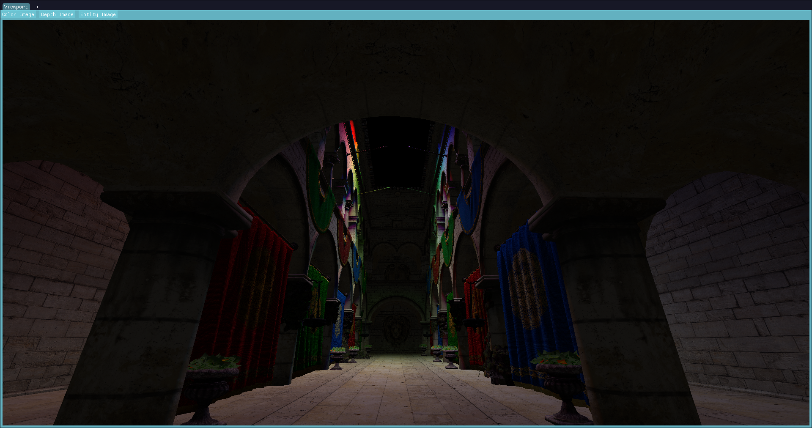
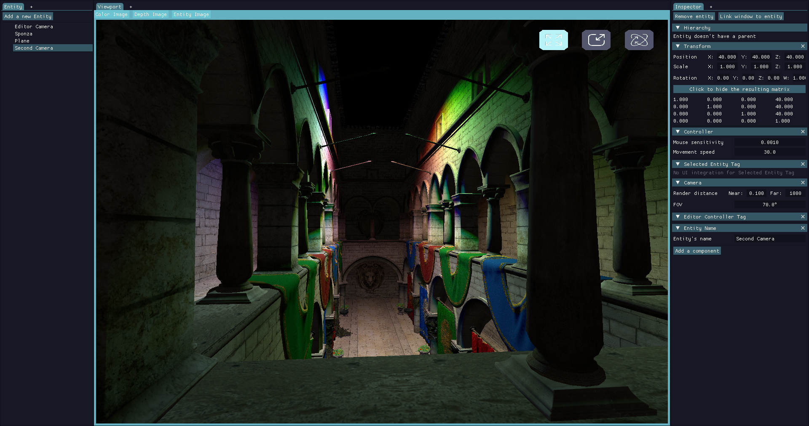
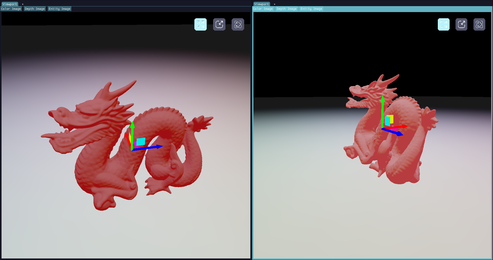

# Hel Engine

> A personal rendering and game engine built from scratch in C++20, using Vulkan as its rendering backend.

----------

## Status

Hel Engine is an **early-stage**, from-scratch rendering and game engine, developed by Hugo Le Henaff as a deep dive into Vulkan and engine architecture — the goal is understanding every layer, from the graphics API up, rather than assembling one from existing libraries and frameworks. Systems are designed deliberately, then iterated on as understanding of the underlying concepts improves. **Updates land roughly every 3 months.**

----------

## Features & Goal

The engine's goal is to explore how a rendering/game engine fits together end to end: scene management, asset pipelines, editor tooling, and rendering techniques, all implemented from scratch.

Two parts currently make up most of the engine:

- **Vulkan wrapper** — Abstracts the most verbose parts of the Vulkan API into focused, RAII-managed types (devices, swapchains, buffers, images, pipelines, descriptors), so higher-level code works with clean C++ objects instead of raw `Vk*` handles and `VkCreateInfo` chains. Buffers and images are allocated through VMA, and pipeline compilation is cached per attachment-format combination via a dedicated `PipelineMap`.
- **Entity Component System (ECS)** — A sparse-set based ECS with versioned entity handles, compile-time `View` queries, and first-class support for GPU-resident components (component pools can back themselves with a VMA storage buffer and track dirty writes automatically).

Around these two, the engine also includes a render queue / GPU readback system, an asset manager, and an ImGui-based editor with its own docking system and style editor.

----------

## Gallery

A few renders and editor views to show where things currently stand *(placeholders below — actual images coming soon)*.

**Sponza — render only**



**Sponza — in the editor**



**Stanford dragon — dual camera view**



----------

## Roadmap

A few of the things planned next:

- **Validation system refactor** — Replace the current class validation layer with `std::expected` for more expressive, value-based error handling.
- **Light definition in engine** — Move light source definitions out of shaders and into the engine layer, for more flexible, data-driven lighting setups.
- **Physics system** — Integrate a basic rigid-body physics simulation.
- **Shadow rendering** — Add support for real-time shadow maps, starting with directional light.

----------

## Getting Started

### Windows

**Requirements**

- Visual Studio with a compiler supporting at least C++20
- CMake and Ninja
- Vulkan SDK with validation layers enabled

**Steps**

1. Clone the repository with all submodules:
    ```sh
    git clone --recurse-submodules https://github.com/hle-hena/Hel-Engine
    ```
2. Open the project folder and configure with CMake.
3. Build and run `hel.exe`.

<br>

### Linux

**Clone the repository:**

```sh
git clone https://github.com/hle-hena/Hel-Engine
cd Hel-Engine
```

**Initialize submodules:**

```sh
git submodule update --init
```

**Run the setup script:**

```sh
./scripts/setup.sh
```

**Build — Debug:**

```sh
cmake --preset linux-debug && cmake --build build -j
```

**Build — Release:**

```sh
cmake --preset linux-release && cmake --build build -j
```
